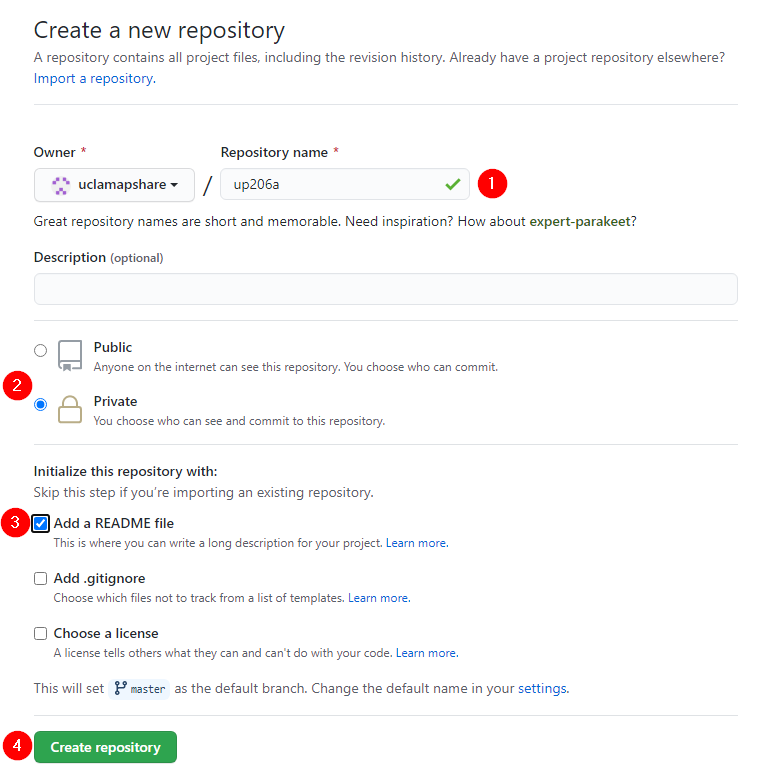

# GitHub workflows

The first time you copy, or clone the class repo, do the following steps:

1. log into the class Jupyter Hub
1. go to New, Terminal
1. in the command prompt, type `git clone repository_url`

Note that you now have a _copy_ of the repository. You can make changes as you wish. However, it is recommended that if you want to experiment with an existing file, duplicate it first, and then make changes on your copy.

## Updating (resetting) the class repo

At the start of every week, I will ask you to reset your class git repo. What I mean by this is that it is likely that the instructors have made changes since we last met, and therefore, we want you to have the latest copy of the class materials. Note that this will overwrite any changes you made to the files in the course repo. It will not delete any duplicate files, or additional files that you may have created.

To reset the repo, do the following:

1. log into the class Jupyter Hub
1. go to New, Terminal
1. In the command prompt, type the following commands.
``` 
git pull
git fetch
git reset --hard
```

## Creating your class repo

In order to submit assignments, store data, and create your own notebooks, you will need to create a class repository.

### Creating a new repo

Go to GitHub and login. Click on "repositories" and "new." Follow the screen directions below:


